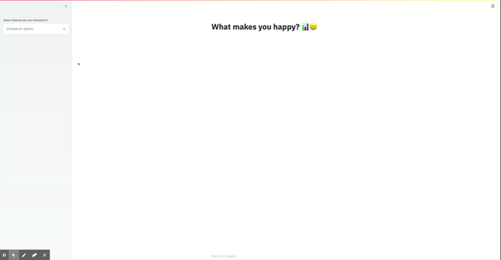
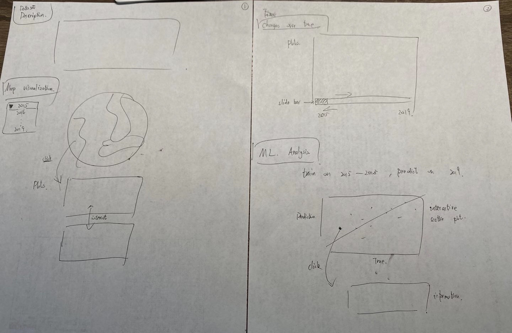

# What makes you happy

**Team members**: 

- Liyun Tu (Andrew ID: liyunt)
- Xiaou Sun (Andrew ID: seansun)

**Data source**: https://www.kaggle.com/unsdsn/world-happiness

Happiness is an important status for most of us, but it is hard to say what makes people happy. Understanding the factors that bring people happiness is the key to improve people’s happiness level and overall life satisfaction. The general goal of this app is to explore the factors related to people’s happy score on a global basis. Utilizing "The World Happiness Report" dataset, we viualize happiness scores of 155 countries with respect to six factors from 2015 to 2019. Users can also select to show various types of regression lines on the plot for their reference.

## Project Goals
Happiness is an important status for most of us, but it is hard to say what makes people happy. Understanding the factors that bring people happiness is the key to improve people’s happiness level and overall life satisfaction. The science of happi-ness is an area of positive psychology concernedwith understanding what behaviors make peoplehappy in a sustainable fashion.  

The main goal of this app is to explore how factors contribute to happy score. Besides, users could look into how their interested country's happiness rank and factor score change between different years. We chose to visualize "The World Happiness Report" dataset, a landmark survey of the state of global happiness to help with the exploration. The dataset includes reports from 2015-2019 each is made up of happiness rank and happiness score of 155 countries around the world based on six factors including economic production (GDP), social support (family), health, freedom, absence of corruption, and generosity. Generally, the app viualize happiness score/country versus six factors. Users can flexibly slide between years, select partial data, and plot regression lines.

## Design

For our first draft of prototype design as below, we followed the trend of homework 2 which designed a series of plots including: scatter plot for basic attribute distribution, spatial visualizaiton for country scores, interactive plot for attribute change over time, and scatter plot with regression line indicating ML prediction. 

Later we realized the app should efficiently convey information and inspire exploration which indicate it should be tightly-focused. We decided to give up the initial design and turned to design two or three informative and interactive plots.  
**General Selection**
Before plotting, we used a multi-selection box to enable users to select one or more factors among GDP, Family, Health, Freedom, Generosity, and Corruption to visualize. Besides, a slide bar is used for selecting year of data. By smoothly switching between years, users can gain an impression of how country's happiness rank and factor scores change over time.

**Plots**
The three plots  

## Development

**Data Cleaning**
The first step of the project would be look into the feature distribution and implement data cleaning. The two issues to be taken care of during this task are (1)missing value and (2) country name mismatch. The dataset is pretty with only one missing value which we decided to evict it. Ideally, each country should correspond to one data line per year and have five in total. By printing out these countries with less data entries, we found multiple names referred to the same country for which we manually corrected to be consistent.

TODO: **An overview of your development process.** Describe how the work was split among the team members. Include a commentary on the development process, including answers to the following questions: Roughly how much time did you spend developing your application (in people-hours)? What aspects took the most time?

**Draft**:

Dataset selection: Kaggle, Assignemnt 2 datasets (n hours)

Data cleaning: (n hours)

Brainsotrming about visualization types:

- Scatter plot for basic attribute correlation
- Spatial visualizaiton: Map
- Changes over time
- ML insights:
  - Predicitons for 2019 V.S. True data in 2019
  - Residual analysis (why some predictions are bad, can be possibly shown by using interactive plot?)
  - \* How the model learns the data? i.e. show the training process?

