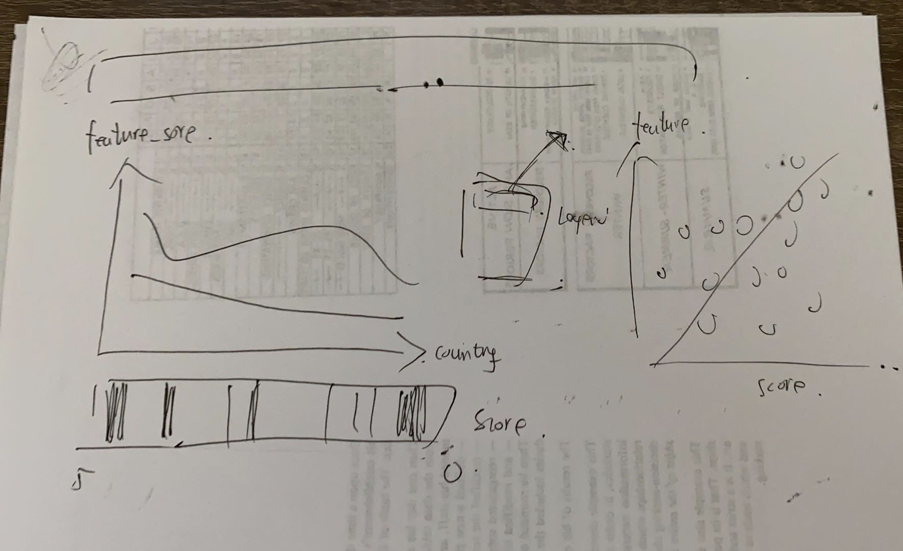

# What makes you happy

**Team members**: 

- Liyun Tu (Andrew ID: liyunt)
- Xiaou Sun (Andrew ID: seansun)

**Data source**: https://www.kaggle.com/unsdsn/world-happiness

Happiness is an important status for most of us, but it is hard to say what makes people happy. Understanding the features that bring people happiness is the key to improve people’s happiness level and overall life satisfaction. The general goal of this app is to explore the features related to people’s happy score on a global basis. Utilizing "The World Happiness Report" dataset, we visualize happiness scores of 155 countries with respect to six features, GDP, family, health, freedom, generosity, and corruption, from 2015 to 2019.

## Project Goals
Happiness is an important status for most of us, but it is hard to say what makes people happy. Understanding the features that bring people happiness is the key to improve people’s happiness level and overall life satisfaction. The science of happiness is an area of positive psychology concerned with understanding what behaviors make people happy in a sustainable fashion.  

The main goal of this app is to explore how features contribute to happy score. Besides, users could look into how their interested country's happiness rank and feature score change between different years. We chose to visualize "The World Happiness Report" dataset, a landmark survey of the state of global happiness to help with the exploration. The dataset includes reports from 2015-2019, each is made up of happiness rank and happiness score of 155 countries around the world based on six features including economic production (GDP), social support (family), health, freedom, absence of corruption, and generosity. Generally, the app visualizes happiness score/country versus the six features. 

## Design

For our first draft of prototype design as below, we followed the trend of homework 2 during which we designed a series of plots including: scatter plot for basic attribute distribution, spatial heatmap for country scores, interactive plot for attribute change over time, and scatter plot with regression line indicating ML prediction. 

Later we realized the app should efficiently convey information to inspire exploration which indicated it should be tightly-focused. We decided to give up the initial design and turned to design two or three informative and interactive plots. 

**General Selection**

Before plotting, we use a multi-selection box to enable users to select one or more features among GDP, family, health, freedom, generosity, and corruption to visualize. Besides, a slide bar is used for selecting year of data. By smoothly switching between years, users can gain an impression of how country's happiness rank and feature scores change over time.

**Plots**

On the top we have a strip plot for happiness score. This plot could represent the distribution of happiness scores. More importantly, users could take it as a interval selector for selecting other two plots. 

Second plot is a multi-line chart. The x-axis refers to the country/region names sorted in descending order of happiness rank while the y-axis includes scores of user selected features. This plot shows the trend of each feature scores between countries. Also, users could investigate how country happiness rank changes over years by sliding the year selection bar.

For the last plot, we use a scatter plot with regression line to show relationhip between feature scores and happiness scores. Users could flexibly select regression type to investigate optimal relationship. Besides, hovering a data point will execute its tooltip showing country name, happiness score, feature type and feature score. 

The plots are closely binded. By choosing the interactive legend on the top right, multi-line chart and scatter plot will highlight the selected features. Besides, selecting the strip plot will simultaneously filter data in other plots and change their axis domain. We hope the flexible interactivity of these plots could insipre users' insights into relationship between the six features and happiness. 

## Development

**Dataset Selection and Cleaning** 
We chose dataset from assignment 2 datasets as well as public datasets on Kaggle.  And we decided to use "The World Happiness Report" from Kaggle for its significnace in indicating key to people's happiness. Then Xiaou implemented data cleaning process. The two issues to be taken care of during this task were (1)missing value and (2) country name mismatch. The dataset was pretty clean with only one missing value which we decided to evict it. Ideally, each country should correspond to one data line per year and have five in total. By printing out countries with less data entries, we found multiple names for one country and then manually corrected them to be consistent.(3 hours/person)

**Brain Storming** 
Having learnt about structure of the dataset, we went on to decide specific project goal. Then we brainstormed candidate plot types and interaction methods. (3 hours/person)

**Initial Design** 
As is mentioned before, our first protype followed the trend of homework 2. Xiaou worked on the interactive plot for feature correlations while Liyun implemented the spatial heatmap for happiness score distribution. (10 hours/person)

**Final Design** 
Having learnt about the issue of initial design, we basically repeated the brainstorming, prototype design, and implmentation process. For efficient coding, we in turn worked as a driver and navigator/researcher. (10 hours/person)

Overall, we roughly spent 26 per person on developing the app. The most time-consuming aspect should be figuring out efficient plots for dataset exploration.
